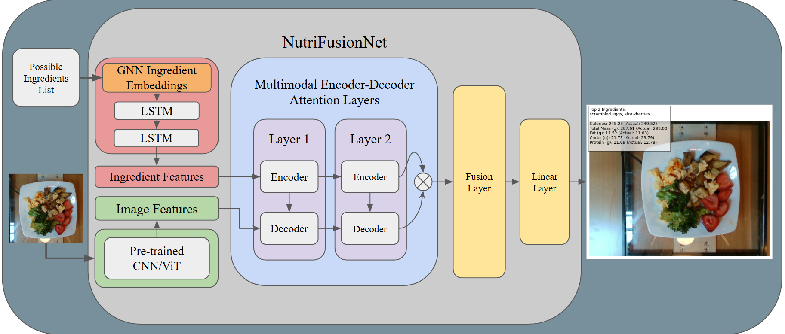
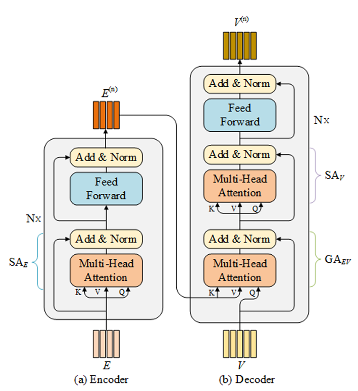
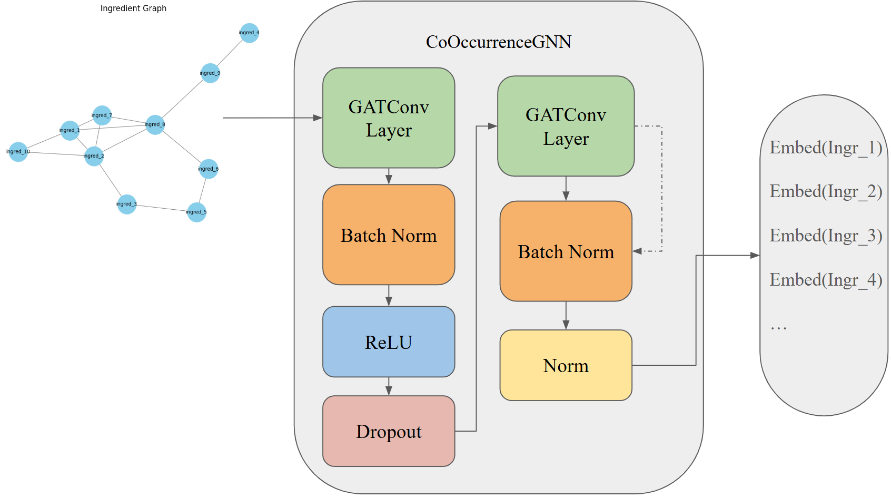
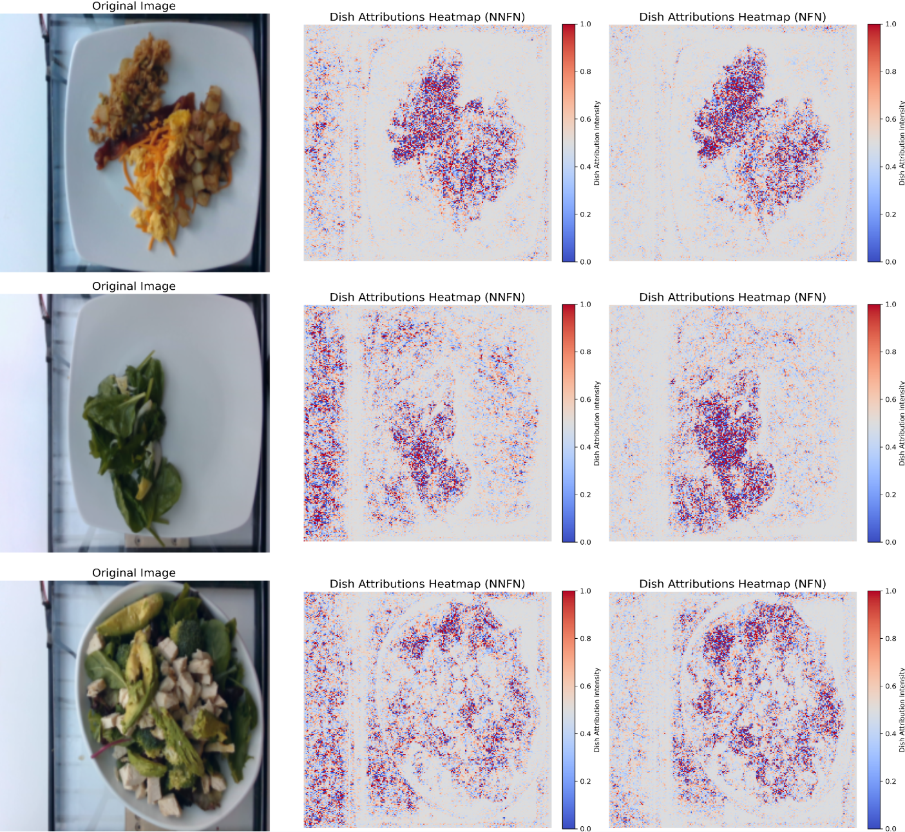

# NutriFusionNet: A Graph-Attention Multimodal Approach for Nutritional Analysis

NutriFusionNet is an advanced machine learning framework designed for estimating nutritional facts from food images. By combining a Visual Question Answering (VQA) framework, Graph-Attentive Ingredient Embedding (GAIE), and multimodal attention mechanisms, NutriFusionNet offers state-of-the-art performance in predicting ingredient masses and nutritional content.

---

## Key Features

- **Ingredient Mass Prediction**: Uses VQA to predict individual ingredient masses, providing more detailed nutritional insights.
- **Multimodal Attention Mechanism**: Ensures precise alignment between visual features and ingredient embeddings.

- **Graph-Attentive Ingredient Embedding (GAIE)**: Improves feature alignment by capturing co-occurrence patterns of ingredients.

- **Model Interpretability**: Integrated Gradients and Grad-CAM visualizations for understanding model behavior.

---

## Project Structure

### Code Implementations

- **Dataset Reconstruction**: Scripts for inspecting and preprocessing the Nutrition5k dataset.
  - [Data Reconstruction Notebook](https://github.com/Lyce24/NutriFusionNet/blob/main/utils/dataset_reconstruction.ipynb)
  - [Preprocess Script](https://github.com/Lyce24/NutriFusionNet/blob/main/utils/preprocess.py)
- **Models**: Implementation of baseline and advanced models.
  - [Model Architectures](https://github.com/Lyce24/NutriFusionNet/blob/main/models/models.py)
- **Training and Evaluation**: Modular scripts for training and testing.
  - [Training Scripts](https://github.com/Lyce24/NutriFusionNet/tree/main/scripts)
  - [Training Command Bash Script](https://github.com/Lyce24/NutriFusionNet/blob/main/scripts/train.sh)
- **Embedding Generation**: GNN-based embedding and failure analysis for BERT embeddings.
  - [Co-Occurrence Embedding](https://github.com/Lyce24/NutriFusionNet/blob/main/embeddings/gnn_embed.ipynb)
  - [Embedding Analysis](https://github.com/Lyce24/NutriFusionNet/blob/main/embeddings/bert_failure.ipynb)
- **Visualization**: Methods for interpreting model decisions.
  - [Integrated Gradients](https://github.com/Lyce24/NutriFusionNet/blob/main/models/captum_attention.ipynb)
  - [Grad-CAM](https://github.com/Lyce24/NutriFusionNet/blob/main/models/grad_cam_cnn.ipynb)

---

## Dataset

NutriFusionNet is trained on the **Nutrition5k** dataset, which contains over 5,000 food images annotated with nutritional information. We reconstructed the dataset to focus on overhead images and valid labels.

### Dataset Challenges

- Limited global diversity: The dataset is primarily U.S.-focused, excluding many international cuisines.
- Label inconsistencies: Some labels contain errors, requiring preprocessing and validation.
- Incremental dataset structure: Facilitates ingredient-level analysis but poses challenges for generalization.

---

## Results

NutriFusionNet achieves state-of-the-art performance:

- **Mean Absolute Error (MAE)**: 24.66, a 61.38% improvement over the baseline.

- **High Classification Accuracy**: 0.86 for identifying ingredient presence.

Key Insights:

- GAIE embeddings outperform BERT by better aligning ingredient relationships.
- NFN delivers comparable results to the Nutrition5k model using simpler inputs (overhead images only).

For more detailed results, see the [performance comparison](https://github.com/Lyce24/NutriFusionNet).

---

## Ethical Considerations

- **Dataset Bias**: The Nutrition5k dataset lacks global diversity, focusing primarily on U.S.-centric dishes.
- **Impact on Users**: Predictions may influence dietary decisions but are not intended for medical use.

---

## Future Directions

- Expanding the dataset to include global cuisines.
- Incorporating 3D dish representations for volume-based analysis.
- Adding multi-task learning for ingredient presence detection.
- Enhancing attention mechanisms with state-of-the-art designs.
- Addressing biases in pretrained embeddings for better results.

---

## References

For a complete list of references and detailed documentation, please refer to the [project report](https://github.com/Lyce24/NutriFusionNet/blob/main/NutriFusionNet_Report.pdf).

---

## Acknowledgments

We extend our gratitude to the creators of the Nutrition5k dataset and related works that inspired this project.

---

## License

This project is licensed under the MIT License. See the [LICENSE](https://github.com/Lyce24/NutriFusionNet/blob/main/LICENSE) file for details.

---

For inquiries or feedback, please contact [Yancheng Liu](mailto:yancheng_liu@brown.edu).
