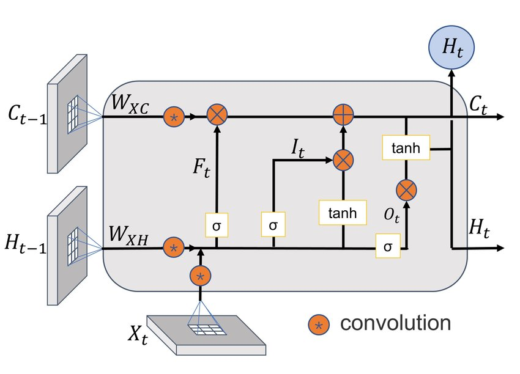

# Project Description

This project aims to develop an **intelligent food recommendation system** that provides personalized food suggestions and nutritional advice based on user inputs such as weight, dietary goals, and dish photos. The system integrates **deep learning models**, **visual recognition technologies**, **natural language processing**, and **knowledge distillation techniques** to deliver accurate recommendations and a seamless user experience.

The project is divided into 2 parts:

1. **Nutrition Prediction**: Predict the nutritional content of dishes from their images using the Nutrition5k dataset by imploying multiple deep learning models (ConvLSTM, InceptionV3 with Multi-Task Heads, and ViT with Multi-Task Heads) to predict calories, mass, fat, carbs, and protein. Moreover, we will utilize knowledge distillation from Llama 3.2 to enhance base model accuracy.

2. **Food Recommendation**: Suggest whether a dish is healthy based on its nutritional information from the task above and user inputs such as weight, dietary goals, and preferences. We will construct a transformer-based model distilled from GPT-3 to provide personalized food suggestions and nutritional advice.

## Progress Summary

### 1. Data Reconstruction

The Nutrition5k dataset originally includes overhead images and side-view videos. For this project, only overhead images are utilized to predict nutritional values. The dataset has been restructured into the following format:

```{bash}
nutrition5k_reconstructed
/images
    - dish_{}.jpeg
    - dish_{}.jpeg
    ...
/labels
    /labels
/metadata
    /train_ids.csv
    /test_ids.csv
```

The `images` folder contains all the overhead images of the dishes. The `labels` folder contains the labels of the dishes including the nutrition information (calories, mass, fat, carbs, and protein). The `metadata` folder contains the train and test ids. Note that the dataset contains incremental nature of dishes (from the original paper), which means that the same dish can appear multiple times in the dataset. The train and test ids are from the original dataset where we don't have any overlapping images of the same plate.

### 2. Data Preprocessing and Splitting

We first observe the distribution of the labels.

|         | Calories      | Mass         | Fat          | Carb         | Protein      |
|---------|---------------|--------------|--------------|--------------|--------------|
| Count   | 3262.000000   | 3262.000000  | 3262.000000  | 3262.000000  | 3262.000000  |
| Mean    | 255.012738    | 214.980074   | 12.727633    | 19.386111    | 18.004492    |
| Std     | 219.637570    | 161.497428   | 13.526409    | 21.605225    | 20.044535    |
| Min     | 0.000000      | 1.000000     | 0.000000     | 0.000000     | 0.000000     |
| 25%     | 80.114996     | 92.000000    | 1.845926     | 6.171500     | 2.128136     |
| 50%     | 209.110062    | 177.000000   | 8.845456     | 15.360000    | 11.488166    |
| 75%     | 375.122963    | 305.000000   | 19.032520    | 27.532451    | 28.034391    |
| Max     | 3943.325195   | 3051.000000  | 106.343002   | 844.568604   | 147.491821   |

In `utils/data_preparation.ipynb`, we normalize the labels and divide the data into train, validation, and test sets. We tried three ways of normalization, one is min-max scaling directly, the other is log transformation followed by min-max scaling, and the last one is log transformation. If we are only using min-max scaling, the data is not well normalized which will make the model to produce negative values. Since most of the data is right-skewed, log transformation can help to normalize the data. In the end, we tried to train models based on log transformation followed by min-max scaling and log transformation. We found that log transformation followed by min-max scaling is the best way to normalize the data. Details are shown in `utils/data_preparation.ipynb`. The data is saved in the `./utils/data` folder where the file with `log` ending is the labels normalized only by log transformation and the file with no ending is the labels normalized by log transformation followed by min-max scaling.

In addition to label preprocessing, image data was resized to consistent dimensions and pixel values were normalized. Data augmentation techniques, such as rotation and flipping, were applied to the training set to improve the model’s generalization capability. Preprocessed data and labels were saved in the `./utils/data/` folder for efficient access during model training. Implementation details, including the normalization strategies, are documented in `utils/data_preparation.ipynb`.

### 3. Model Training

The project employs an integrated training pipeline for three backbone models: ConvLSTM, InceptionV3 with Multi-Task Heads, and ViT with Multi-Task Heads. This process is implemented in `train.py` and `./models/models.py`. All models were trained on the preprocessed dataset, and outputs include five predictions: calories, mass, fat, carbs, and protein. Training progress, including loss curves, is saved in the `./plots` folder, while model checkpoints are stored in `./models/checkpoints`. Slurm support is provided through `train.sh` for efficient distributed training.

Each model uses fully connected heads for the final predictions, with the primary difference being the backbone architecture. For now, the best model is the ViT with Multi-Task Heads as shwon in `./results` folder.

### 3.1. ConvLSTM Backbone

ConvLSTM (Convolutional Long Short-Term Memory) integrates convolutional operations with LSTM units, enabling the model to capture both spatial and temporal dependencies in sequential data. This architecture is particularly effective for tasks involving spatiotemporal patterns, such as video analysis or time-series prediction.



ConvLSTM can effectively captures spatial and temporal correlations, making it suitable for dynamic data. Moreover, it utilizes shared weights, reducing the number of parameters compared to separate convolutional and LSTM layers. However, ConvLSTM is computationally expensive and may require more training data to prevent overfitting.

### 3.2. InceptionV3 Backbone

InceptionV3 is a convolutional neural network architecture that employs Inception modules to capture multi-scale features. These modules perform parallel convolutions with various filter sizes, allowing the network to process information at multiple scales simultaneously. InceptionV3 also incorporates techniques like factorized convolutions and auxiliary classifiers to enhance performance and efficiency.


It can effectively capture features at different scales, improving recognition accuracy. Additionally, InceptionV3 is computationally efficient due to its factorized convolutions and parallel processing. However, the model may be prone to overfitting on small datasets, requiring regularization techniques like dropout and data augmentation.

### 3.3. ViT Backbone

The Vision Transformer (ViT) applies the transformer architecture, originally designed for natural language processing, to image data. It divides an image into fixed-size patches, linearly embeds them, and processes the sequence of embeddings using transformer encoders. This approach allows the model to capture long-range dependencies and global context within images.


It can effectively capture global context and long-range dependencies in images, improving recognition accuracy. Moreover, ViT is highly parallelizable and scalable, making it suitable for large-scale datasets. However, ViT may require large amounts of training data to generalize well and may be computationally intensive due to the transformer's self-attention mechanism.

### 4. LLM Inference

Besides baseline model traring, in `notebooks/llm_inference.ipynb`, we also implement the inference process of LLM (Llama 3.2) to predict the nutrition information of the dishes. The LLM model is from facebook as `meta-llama/Llama-3.2-11B-Vision-Instruct` on Hugging Face. The model is pretained to take `image + instruction` as input and output the required `text`. We use the Llama to predict the nutrition information of the dishes as well. We will use the LLM's predictions to further improve our models using K-L divergence as the loss function.

### 5. Model Evaluation

In `eval.py`, we evaluate the performance of the trained models on the test set using metrics such as Mean Squared Error (MSE) and Mean Absolute Error (MAE). Since we normalized the labels, we also calculate the inverse transformation of the predictions to obtain the actual values. The evaluation results are saved in the `./models/checkpoints/models.md` file for further analysis and comparison.

## Future Work

To further enhance this project, we plan to improve both models and the overall pipeline. First, we aim to optimize the deep learning models by tuning hyperparameters, experimenting with alternative loss functions, and applying additional regularization techniques to mitigate overfitting. Second, improvements to Llama inference will focus on better prompt engineering to reduce irrelevant outputs and stabilize predictions. Once refined, the Llama model will be used to distill knowledge into our best-performing models.

Beyond model training, we will implement explainability techniques such as SHAP or LIME (From Mini-Project 1) to better interpret and trust model predictions. Finally, after completing the nutritional prediction pipeline, we will develop the food recommendation system using a transformer-based architecture to provide users with personalized dietary advice based on both nutrition data and their individual goals. This comprehensive approach ensures a robust and user-centric recommendation system.
